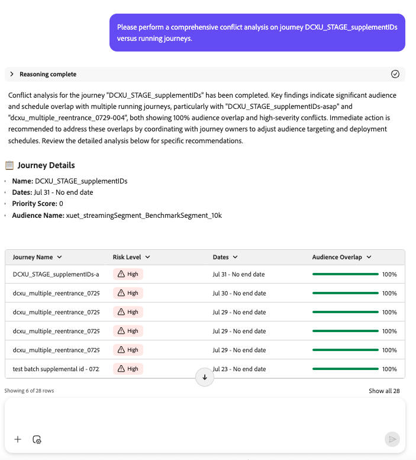

# Journey Agent：概述和用户指南

## Adobe Journey Optimizer中的Journey Agent简介

Journey Agent使Journey Optimizer用户能够使用自然语言界面创建、分析和优化营销历程。 通过 Journey 代理，从业者可以快速构建历程、发现并解决计划或受众冲突、分析性能和流失点，确定表现最佳的历程并将其复制用于未来的营销活动。 它使从业者能够做出数据驱动型决策、提高客户参与度并简化历程编排。

Journey Agent包含四个主要待完成任务：

- **历程创建**：通过自然语言提示生成和配置营销历程
- **渠道内容创建**：使用AI支持的内容生成功能生成、编辑和管理历程的渠道特定内容（电子邮件、推送、短信）
- **历程分析**：分析历程、检测问题、揭示见解并优化客户参与

此外，**历程模拟**&#x200B;是Journey Optimizer的一项功能，其中包括[历程模拟](https://experienceleague.adobe.com/zh-hans/docs/journey-optimizer/using/orchestrate-journeys/create-journey/validate-journey/simulate-journey/simulate-journey-gs){target="_blank"}，这是一项产品内的非对话式AI功能，具有三个子功能：

- 生成模拟用户
- 生成事件值
- 快速模拟

## 历程创建：用例、AI功能和用户指南 {#journey-create}

## 概述

通过历程创建，Journey Optimizer用户可以使用自然语言界面构建和配置营销历程。 借助历程创建，从业者可以通过在对话提示中描述其要求来快速创建历程。 代理可简化历程创建，允许营销人员专注于策略而不是技术配置。

有关详细信息，请参阅Adobe Journey Optimizer文档中的[历程创建](https://experienceleague.adobe.com/zh-hans/docs/journey-optimizer/using/get-started/essentials/ajo-coworker-skills#journey-create){target="_blank"}。

>[!AVAILABILITY]
>
>要充分利用历程创建功能，您需要以下权限：
>
>**管理历程**：此权限允许您直接在AI助手中创建新旅程。
>
>**查看历程事件、数据源和操作**：此权限确保AI助手可以搜索历程事件和自定义操作。
>
>**查看区段**：此权限可确保AI助手在创建历程时能够搜索受众区段。
>
>**管理区段**：此权限允许您直接在AI助手中创建新受众。

## 用例

### 历程创建的主要用例

历程创建可加快营销执行的优惠功能：

1. **事件触发的历程创建**

   - 创建根据特定客户事件激活的历程。
   - 实时设计对客户行为的自动化响应。
   - 基于客户行为构建个性化的通信流。

1. **面向受众的历程创建**

   - 构建以特定受众区段为目标的历程。
   - 设计具有策略时间的多步通信序列。

1. **业务事件触发的历程创建**

   - 创建根据特定业务事件激活的历程，并以指定受众为目标（例如，产品回售或游戏分数更改）
   - 基于客户行为构建个性化的通信流。

1. **受众资格历程创建**

   - 创建历程，并在用户档案进入或退出受众区段定义时激活。
   - 基于客户行为构建个性化的通信流。

1. **条件历程流**

   - 根据客户属性创建决策分支。
   - 根据客户喜好设计拆分路径。

1. **从图像创建历程**

   - 上传参考图像并要求代理使用图像作为参考创建历程。
   - 代理从参考图像中提取可编辑的提示。

对于其中每个用例，代理都会将自然语言需求转换为结构化历程配置。

## AI功能在范围和范围外

### **在作用域中**

历程创建支持以下功能：

- **自然语言历程创建**：允许用户以对话语言描述历程流程。
- **基于事件和基于受众的历程**：支持基于触发器和计划的历程类型，以及业务事件和受众资格。
- **条件逻辑**：根据客户属性处理决策拆分和分支。
- **多渠道消息传递**：支持推送通知、电子邮件和短信渠道。
- **历程计划**：配置计划历程的开始日期和时间。

### **超出范围**

目前不支持以下功能：

- **高级历程分析**
- **跨历程编排**
- **A/B测试配置**
- **InAudience表达式生成**
- **数据集查找节点**
- **波形发送设置**
- **计划周期性选项**
- **受众的命名空间选择**
- **自定义操作字段映射**
- **复杂的数据转换**

## 示例提示

### 创建历程的常见提示

以下是用户可以利用的有价值提示创建历程的示例。

### 事件触发的历程提示

**商店访问历程：**

“创建在用户进入我的商店位置时开始的历程。 发送推送通知以欢迎用户访问应用商店。 等待2天并检查用户是否具有有效的电子邮件地址。 如果用户拥有有效的电子邮件地址，请发送电子邮件调查来询问其商店体验。 如果用户没有有效的电子邮件地址，请发送推送通知以提示注册。”

**购买后历程：**

“创建客户在线购买时开始的历程。 发送推送通知以感谢他们购买。 接下来，检查他们是否是忠诚会员。 如果用户是忠诚度奖励会员，请发送带有10%折扣代码的第二个推送通知。 如果用户不是忠诚度奖励成员，请发送推送，邀请他们注册忠诚度计划。 请等待2天，然后发送后续推送信息，其中包含有关其购买体验的调查。”

**基于事件的促销活动：**

“创建游戏分数达到50时触发的历程。 向忠诚会员发送一条短信消息，称他们有资格从合作伙伴赞助商那里免费分到披萨。”

### 面向受众的历程提示

**季节性营销活动：**

“我想创建一个以日间徒步旅行者为目标的历程。 我想发送一封电子邮件，提醒此受众我即将到来的假期促销，其中包括各种徒步旅行必需品。 在发送第一封电子邮件后等待3天，然后再发送一封包含15%优惠券且免运费的第二封电子邮件。 等待一周，然后发送第3封电子邮件展示我们的新睡袋和帐篷收藏。 安排在12月20日开始历程。”

**忠诚度感谢：**

“为SUV车主打造忠诚度提升历程，包括提供免费洗车优惠的感谢推送通知以及后续推送通知提醒（如果第一个通知未在1天内进行交互）。”

### 开放式提示

对于没有考虑特定历程的开始用户：

- “我想创建一个历程”
- “帮助我创建旅程”
- “给我创建一个历程”

代理将提供指导和示例，帮助您定义历程要求。

## 最佳实践

### 提示最佳实践

要最大限度地提高历程创建效率，请遵循以下最佳实践：

1. **具体**：提供有关历程目标、目标受众和所需操作的清晰详细信息。 包括有关渠道、计时和条件的信息。
1. **指定时间**：明确指示操作之间的等待时间以及历程应何时开始。
1. **定义条件**：使用条件逻辑时，请说明每个分支路径的条件。
1. **包括渠道**：指定要使用的通信渠道（推送、电子邮件、短信）。
1. **提及计划**：对于计划的历程，请提供所需的开始日期和时间。
1. **自定义操作**：如果您在工作流中使用自定义操作，则需要指定您使用的是自定义操作以及自定义操作的确切名称。 示例：
当用户进入我的商店位置时，使用自定义操作ExternalPush发送欢迎消息。 等待2天，然后使用自定义操作ExternalEmail发送跟进消息，其中包含有关其访问情况的调查。
1. **验证表达式**：确保检查并验证Journey Agent创建的任何表达式，以确保使用正确的字段和值。

### 设置最佳实践

- **定义明确的目标**：在创建历程之前，请建立明确的目标（提高维系率、促进转化、提高参与度）。
- **准备受众**：确保已创建目标受众并正确分段。
- **规划消息内容**：在创建历程之前定义消息传递策略。
- **考虑客户体验**：设计尊重客户偏好并避免过度沟通的历程流程。

## 渠道内容创建：用例、AI功能和用户指南 {#channel-content-create}

>[!AVAILABILITY]
>
>此功能仅对有限可用的所有客户可用。 请联系 Adobe 代表获取访问权限。

## 概述

渠道内容创建使Journey Optimizer用户能够使用AI支持的内容生成来生成、编辑和管理历程的特定于渠道的内容。

有关详细信息，请参阅Adobe Journey Optimizer文档中的[渠道内容创建](https://experienceleague.adobe.com/zh-hans/docs/journey-optimizer/using/get-started/essentials/ajo-coworker-skills#channel-content-create){target="_blank"}。

## 用例

### 渠道内容创建的主要用例

1. **特定于渠道的内容生成**：使用自然语言提示生成电子邮件、推送通知、SMS和其他渠道的内容。

1. **基于模板的内容创建**：通过预览功能浏览并选择可用模板。

1. **多渠道内容管理**：在同一历程工作流中为多个渠道生成和管理内容。

1. **In-context内容编辑**：在Content Designer中打开生成的内容进行编辑和细化。

1. **内容精简和迭代**：使用重新生成操作重新生成具有不同色调或样式的内容。

1. **历程画布集成**：从清单中选择历程并查看关联的渠道。

## AI功能在范围和范围外

### **在作用域中**

渠道内容创建支持以下功能：

- **AI支持的内容生成**：使用自然语言提示生成电子邮件、推送、SMS和其他渠道的内容。
- **模板管理**：浏览并从具有预览功能的可用模板中进行选择。
- **In-context editing**：在Content Designer中打开生成的内容以进行编辑和细化。
- **内容重新生成**：使用“重新生成”操作重新生成具有不同色调、样式或消息传递的内容。
- **多渠道支持**：在同一历程工作流中为多个渠道生成和管理内容。
- **历程库存访问**：从库存中选择历程并查看关联的渠道。

### **超出范围**

目前不支持以下功能：

- **品牌一致性和内容质量检查**
- **将内容节点直接插入历程画布**
- **模板导入**

## 示例提示

### 内容生成

“为我的欢迎历程生成电子邮件内容。 用友好的语气为新客户创建欢迎电子邮件，并包含10%的折扣优惠。”

&quot;为我的欢迎历程的渠道电子邮件添加内容。&quot;

&quot;为我的商店访问历程生成推送通知。 创建欢迎消息，鼓励客户登记并接收特惠。”

“为事件触发的历程生成短信内容。 使用call-to-action创建一条短消息，通知客户闪购。”

### 模板选择

“向我显示季节性活动历程的可用电子邮件模板。”

“为我的电子邮件选择一个设计新颖、简洁的模板。”

### 内容编辑和细化

“在Content Designer中打开电子邮件内容，以便我可以自定义设计。”

“重新生成推送通知内容，语调更加随意。”

“更新电子邮件内容以包含促销代码。”

## 最佳实践

### 提示最佳实践

1. **明确**：提供有关内容类型、语调、目标受众和关键消息的清晰详细信息。
1. **指定渠道**：明确指示您正在为哪个渠道创建内容（电子邮件、推送、短信）。
1. **定义音调**：指定所需的音调（友好、正式、休闲、紧急）。
1. **迭代并优化**：使用重新生成操作优化内容，直到满足您的要求为止。

## 历程分析：用例、AI功能和用户指南 {#journey-analyze}

## 概述

历程分析使Journey Optimizer用户能够使用自然语言界面分析和优化旅程。 借助历程分析，从业者可以快速识别和解决计划和受众冲突，检测历程中的用户放弃点，以及提供见解或建议以提高性能。

在此[概述](https://experienceleague.adobe.com/zh-hans/slides/journey-agent-overview)中了解更多信息并快速发现代理。

有关详细信息，请参阅Adobe Journey Optimizer文档中的[历程分析](https://experienceleague.adobe.com/zh-hans/docs/journey-optimizer/using/get-started/essentials/ajo-coworker-skills#journey-analyze){target="_blank"}。

>[!AVAILABILITY]
>
>Journey Agent适用于有权访问AI Assistant的所有客户。 但是，您需要以下权限才能完全使用Journey Agent功能：
>
>**查看历程**：此权限允许您直接在AI助手中查看历程见解。
>
>**管理历程**：“收件人”权限允许您直接在AI助手中创建新旅程。
>
>**查看区段**：此权限允许您直接在AI助手中查看受众分析。
>
>**管理区段**：“收件人”权限允许您直接在AI助手中创建新受众。

AJO代理的

## 用例

### 历程分析的主要用例

历程分析提供了一系列可用于优化营销工作的功能：

1. **历程流失分析**

   - 确定客户在历程中的何处流失以及原因。
   - 识别导致客户停止参与的行为模式。
   - 利用洞察来改进历程设计，提高保留率。

1. **历程受众重叠分析**

   - 分析多个历程中的受众重叠。
   - 防止因目标选择过度而导致受众疲劳。
   - 优化分段，以确保均衡的参与度。

1. **历程计划重叠分析**

   - 识别针对同一受众群体的预定的历程之间的时间冲突。
   - 避免过度沟通，提高计划效率。
   - 确保历程在最佳时间运行，最大限度地发挥受众影响力。

1. **运营洞察**

   - 基于提示的历程见解 — 有关历程的表面运营见解，即“显示所有实时历程”。

1. **自定义操作错误历程**

   - 识别历程中的自定义操作何时失败或错误率何时激增。
   - 在故障演变成更广泛的历程中断之前诊断根本原因。
   - 使用特定的修正步骤快速恢复自定义操作的可靠性。

1. **分析历程异常**

   - 与历史基线相比，检测历程的进入、退出或消息发送计数中意外的峰值、下降或扁平化，包括何时在进入、退出或完成历程的用户档案数量方面提及问题。
   - 使用确定性统计检查，而不是仅依赖原始异常标记，确认标记的更改是否是真正的异常。
   - 针对历程执行数据运行有界只读诊断以识别可能的根本原因，显示每个检查查找的内容以及与推荐一起找到的内容。
   - 调查引用特定历程版本和时间戳的异常警报。

对于其中每个分析，代理不仅会检测问题，还会提供&#x200B;**可操作的建议来解决问题**。

## AI功能在范围和范围外

### **范围内**

历程分析支持以下功能：

- **回应式查询**：允许用户询问有关历程表现、受众使用情况和时间计划冲突的具体问题。
- **与其他代理集成**：与 Audience 代理和 Data Insights 代理协作进行更深入的分析。
- **代理响应结构**：推理（解释逻辑）、分析摘要（突出显示关键点）、问题详细信息（描述问题）和推荐（建议后续步骤）。
- **自定义操作错误分析**：检测和诊断历程中的自定义操作失败和错误峰值。
- **异常检测**：检测和确认历程的进入、退出或发送计数中具有统计意义的峰值、下降或平线，并找出可能的根本原因。

### **范围外**

目前不支持以下功能：

- **自动创建历程**
- **渠道重叠**
- **历程进入分析**
- **技术问题分析**
- **疲劳分析**

## 提示示例

### 用于历程分析的常见提示

以下是可供用户使用的很有帮助的提示示例，用于浏览、监控他们的历程以及解决相关的问题。

### 关于历程生命周期的问题

- “[历程名称]何时发布？”
- “[历程名称]何时停止？”
- “列出当前处于测试模式的所有历程”

### 关于历程资源的问题

- “我有多少个实时历程？”
- “向我提供所有计划定期历程及其预期运行时间的列表。”

### 受众和历程洞察

- “超过X个历程中使用了哪些受众？”
- “使用[受众名称]受众列出所有历程。”

### 流失分析

- “我想按节点分析7月4日营销活动旅程的流失。”
- “为7月4日营销活动的历程执行流失分析。”
- “在‘七月四日’营销活动的历程中，用户档案丢失情况如何？”
- “展示7月4日营销活动在旅程中用户流失的位置。”

### 冲突分析提示

使用这些提示词来分析历程之间的潜在冲突，包括时间计划和受众重叠：

- “能否对包含冲突类型（计划/历程）信息的历程[受众名称]与实时/正在运行的历程的冲突进行全面分析？”
- “请对包含冲突类型信息的历程[历程名称]进行计划冲突分析。”
- “请对包含冲突类型信息的历程[受众名称]进行历程重叠分析。”
- “历程[历程名称]是否存在任何计划冲突？”
- “向我显示历程[受众名称]的历程重叠冲突。”
- “分析历程[历程名称]与其他实时历程的所有冲突。”
- “历程[历程名称]当前有哪些冲突？”
- “检查历程[历程名称]是否与其他历程存在受众冲突。”
- “检查与历程[历程名称]有关的计划冲突。”
- “我想了解[历程名称]的所有旅程冲突。”
- “是否有任何实时历程按计划或受众与[历程名称]冲突？”
- “与正在运行的历程相比，识别历程[历程名称]的冲突类型。”
- “显示历程[历程名称]和其他历程的重叠受众。”
- “突出显示历程[历程名称]和实时历程之间的计划重叠。”
- “历程[历程名称]是否正在运行与任何其他历程冲突？”
- “请检测并列出[历程名称]的冲突。”
- “报告历程[历程名称]的所有类型的冲突。”
- “给我一个[历程名称]的冲突划分（计划和受众）。”
- “[历程名称]是否存在任何可能影响性能的冲突？”
- “是否存在影响[历程名称]的活动冲突？”
- “按计划或受众列出与[历程名称]冲突的历程。”
- “历程[历程名称]是否触发了任何冲突警报？”
- “查找历程[历程名称]的潜在受众冲突。”
- “分析历程[历程名称]的冲突风险。”
- “为[历程名称]提供冲突诊断。”

### 自定义操作错误分析

- “为什么自定义操作在历程[历程名称]中失败？”
- “历程[历程名称]中的自定义操作[自定义操作名称]的错误率是多少？”
- “显示历程[历程名称]中自定义操作失败的根本原因。”
- “当前是否存在影响历程[历程名称]的自定义操作错误？”

### 历程异常分析

- “为什么昨天我的欢迎之旅的条目减少了？”
- “本周购物车放弃历程的退出次数是否激增？”
- “今天续订提醒历程的发送次数看起来很低 — 发生了什么？”
- “为什么在过去30天内进入我的会员周年感谢之旅的用户档案数量会突然减少？”
- “本月完成我的续订提醒历程的用户档案比平时少 — 为什么？”
- “在[时间戳]触发了历程[历程版本ID]的异常警报 — 调查。”

## 最佳实践

### 提示最佳实践

要最大限度地提高历程分析的有效性，请遵循以下最佳实践：

1. **描述具体**：使用清晰简洁的提示来获得有针对性的见解。 例如，请指定“列出上个月创建的所有历程”，而不是询问“我的历程是什么？”。
1. **结合洞察**：结合来自 Audience 代理和 Data Insights 代理的洞察，全面了解历程的表现。
1. **迭代改进**：使用流失和重叠分析来迭代改进历程设计和时间计划。

### 设置最佳实践

- **定义明确目标**：在分析历程之前，先确定明确的目标（例如提高保留率、增加转化率）。
- **定期监测**：计划好定期查看历程表现，以识别趋势和异常。
- **优化分段**：确保受众细分均衡，以避免疲劳以及最大限度地提高参与度。

## 历程模拟：用例、AI功能和用户指南 {#journey-simulate}

## 概述

>[!BEGINSHADEBOX]

历程模拟适用于所有Journey Optimizer客户。 历程模拟是历程模拟中的产品内代理AI功能，适用于作为Agent Orchestrator Explorer程序的一部分并且至少需要以下权限之一的客户：

- **模拟历程**：从历程画布运行模拟工作流。

- **发布历程**：发布历程，包括在上线前使用模拟的流程。

- **批准和发布历程**：当您的组织使用批准工作流时，批准和发布历程。

要在&#x200B;**[!UICONTROL 模拟]** （**[!UICONTROL 快速模拟]**，使用AI生成模拟用户，**[!UICONTROL 生成事件值]**）中使用AI，用户需要&#x200B;**[!UICONTROL AI助手]**&#x200B;功能的&#x200B;**[!UICONTROL 生成内容]**&#x200B;权限。

[了解有关权限的更多信息](https://experienceleague.adobe.com/zh-hans/docs/journey-optimizer/using/access-control/permissions)。

>[!ENDSHADEBOX]

历程模拟是Journey Optimizer的一项功能，它允许Journey Optimizer用户在激活之前安全地测试和验证营销历程。 在历程模拟中，历程模拟是产品内的人工智能功能，不是对话式功能，它直接从旅程画布自动化和协助测试过程。

历程模拟包括三项功能：

- 生成模拟用户
- 生成事件值
- 快速模拟。

它们共同弥合历程创建和激活之间的差距，树立对历程逻辑的信心，并降低启动后错误的风险。

## 用例

### 历程模拟的主要用例

历程模拟提供了三项功能，可在上线前利用它们来缩短测试时间并提高历程质量：

**正在生成模拟用户**

- 根据历程路径和所需属性自动生成模拟用户。
- 创建涵盖历程中所有分支和条件的模拟用户，包括执行地址（电子邮件、推送、短信）。
- 根据需要更新模拟的用户属性以优化测试方案。
- 通过为每个路径分配正确的模拟用户，确保涵盖所有旅程分支。

**正在生成事件值**

- 为历程中使用的事件生成值，以通过特定路径推动测试执行。
- 定义在模拟期间触发所需条件和分支的事件属性值。

**快速模拟**

- 在单个交互中，开始历程模拟并触发测试历程的所有路径所需的所有模拟用户的测试执行。
- 可视化模拟的用户如何逐步完成历程，包括分支路径和条件逻辑。
- 通过详细的逐节点遍历，识别哪些模拟用户流经哪条路径，以及原因。
- 在Journey Optimizer UI中运行结束后查看模拟报表，以在激活之前验证结果。

## 范围AI功能和限制

### **在作用域中**

历程模拟功能支持以下功能：

- **模拟用户管理**：查看、编辑和更新模拟的用户属性，包括执行地址和个性化数据。
- **模拟控制**：直接通过历程模拟产品内体验开始和停止旅程模拟。
- **测试执行**：触发一个或多个模拟用户的测试执行。
- **历程流可视化图表**：查看模拟用户通过旅程节点的分支情况、拆分情况以及用户状态的分步遍历。
- **模拟报表**：在Journey Optimizer UI中运行模拟结束时查看报表。
- **多用户测试**：同时运行和可视化多个模拟用户的测试，涵盖所有历程分支。

除此之外，历程模拟人工智能功能还支持以下功能：

- **模拟用户生成**：根据历程路径、现有测试配置文件或指定属性创建模拟用户。
- **事件值生成**：生成并分配事件属性值以通过特定历程路径推动测试执行。
- **快速模拟**：运行完整的端到端模拟，只需很少的干预。 此AI功能自动生成模拟用户、事件值和预填充的测试设置，然后执行历程和显示结果以供审查。

### **限制**

模拟可能不支持测试模式或实时历程支持的每个活动、渠道或集成，并且行为可能会随着功能成熟而更改。

➡️在Journey Optimizer文档中了解有关[模拟限制](https://experienceleague.adobe.com/zh-hans/docs/journey-optimizer/using/orchestrate-journeys/create-journey/validate-journey/simulate-journey/simulate-journey-gs#limitations){target="_blank"}的更多信息。

## 另请参阅

- [Agent Orchestrator](./agent-orchestrator.md)，支持Journey Agent和其他Experience Platform代理的代理层。
- CX Coworker Gateway中的[Journey Optimizer工具](../mcp/ajo-mcp.md)，用于审阅营销活动和渠道配置的只读MCP表面。
- [从自然语言创建历程](../coworker/chat/use-cases/journeys/create-journey-from-natural-language.md)和[创建、编辑和管理忠诚度挑战](../coworker/chat/use-cases/journeys/create-loyalty-challenge.md)，在历程创建的基础上构建的同事聊天用例。
- [产品支持代理](./product-support.md)，用于解决通过AI助手显示的Journey Optimizer问题。
