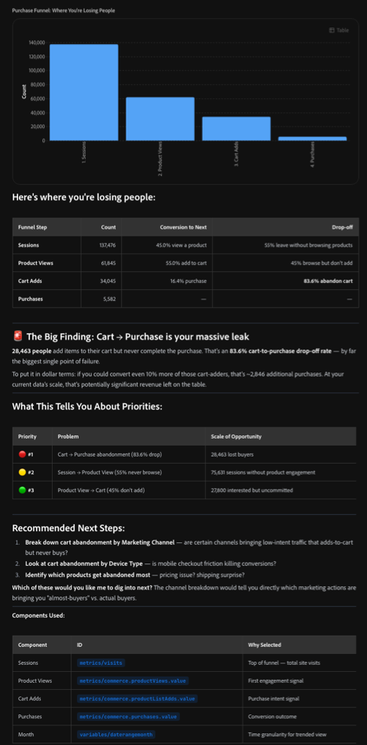

# 通过同事聊天分析Customer Journey Analytics数据

>[!AVAILABILITY]
>
>本文中描述的功能处于版本的有限测试阶段，可能尚未在您的环境中可用。 当功能正式可用时，将删除此注释。 有关Customer Journey Analytics发布过程的信息，请参阅[Customer Journey Analytics功能发布](https://experienceleague.adobe.com/zh-hans/docs/analytics-platform/using/releases/latest)。

Adobe CX Enterprise Co-worker Chat可以执行以前只能在Analysis Workspace中进行的高级数据分析。 Co-worker Chat访问来自Customer Journey Analytics数据视图的数据，允许您浏览该数据并获得自然语言提示的答案。

在开始分析之前，请了解Co-worker Chat界面和配置选项，然后确保Co-worker已连接到Customer Journey Analytics以及包含要使用的数据的数据视图。

## 同事聊天入门

### 界面和配置选项

在使用“同事聊天”处理Customer Journey Analytics数据之前，了解如何登录并管理以下功能的配置选项：

* 聊天输入

* 对话

* 市场

* MCP服务器

* 内存

* 插件

* 技能

* 等等

有关详细信息，请参阅[同事聊天用户界面指南](https://experienceleague.adobe.com/en/docs/cx-enterprise-coworker/content/chat/ui-guide)。

### Customer Journey Analytics的用例

您可以在Adobe CX Enterprise Co-worker Chat中看到从业者正在使用的Customer Journey Analytics用例和示例提示。 每个提示都构建为可复制、根据您自己的数据和上下文进行调整，并通过对话进行细化。

有关详细信息，请参阅[用例](https://experienceleague.adobe.com/en/docs/cx-enterprise-coworker/content/chat/use-cases)。

## 验证同事聊天是否已连接到Customer Journey Analytics

1. 在同事聊天中，验证同事是否已连接到Customer Journey Analytics：

1. 选择左边栏中的MCP图标，然后确保&#x200B;[!UICONTROL **cja-mcp**]&#x200B;在连接的MCP服务器列表中可用。

   

1. （视情况而定）如果尚未连接&#x200B;[!UICONTROL **cja-mcp**]，请选择&#x200B;[!UICONTROL **添加MCP服务器**]，在&#x200B;[!UICONTROL **服务器名称**]&#x200B;字段中指定cja并在其出现时将其选定，然后选择&#x200B;[!UICONTROL **添加服务器**]。

## 连接到正确的数据视图

数据视图是Customer Journey Analytics中的一个容器，可确定如何解释数据。

您可能有权访问Customer Journey Analytics中的各种数据视图，每个视图都包含同事在分析数据时可以使用的不同维度和量度。

### 决定要使用的数据视图

告诉同事您希望回答的问题类型，并询问您有权访问哪些数据视图最能提供该信息。 您还可以[将您的数据视图设置为内存](#add-a-data-view-preference-in-memory)中的首选项。

**您：**

>[!BEGINSHADEBOX]

我感兴趣的是了解客户在客户历程中的流失情况。 Customer Journey Analytics中我可以访问哪些数据视图，以便回答此问题？

>[!ENDSHADEBOX]

**同事聊天响应：**

>[!BEGINSHADEBOX]

您有权访问三个数据视图。 `Customer lifecycle`数据视图包含以下维度和量度，最适合回答您的问题。

>[!ENDSHADEBOX]

**您：**

>[!BEGINSHADEBOX]

很好，让我们使用该数据视图。

>[!ENDSHADEBOX]

**同事聊天响应：**

>[!BEGINSHADEBOX]

好的，我将使用`Customer lifecycle`数据视图来回答此聊天会话中未来的问题。

>[!ENDSHADEBOX]

### 在内存中添加数据视图首选项

Co-worker Chat包含内存功能，允许您访问跨越所有聊天的信息。 最好将您首选的数据视图添加为同事记忆中的首选项。

1. 在“同事聊天”的左侧导航栏中，选择“内存”图标。

1. 在“内存”页的“存储的首选项”部分，指定您希望Co-worker Chat在聊天中使用的一个或多个数据视图。

   左边栏中的

## 在Customer Journey Analytics中分析

Co-worker创建可视化图表后，您可以在Customer Journey Analytics的Analysis Workspace中打开该可视化图表，以便通过更精细的控制进行更深入的分析。 该可视化图表在Customer Journey Analytics的新Analysis Workspace项目中打开。

要在新的Analysis Workspace项目中打开可视化图表，请执行以下操作：

1. 选择“在CJA中分析”[!UICONTROL **&#x200B;**]，位于在同事中创建的任何可视化图表旁边。

1. 在Customer Journey Analytics中打开可视化图表后，您可以使用Analysis Workspace拖放浏览器界面进行修改、进一步构建分析、创建受众等等。 您甚至可以与所选的任何人共享您的Workspace项目。

   有关Analysis Workspace的更多信息，请参阅[Analysis Workspace概述](https://experienceleague.adobe.com/zh-hans/docs/analytics-platform/using/cja-workspace/home)。

## 示例：查找客户流失的位置

您可以请求Co-worker Chat使用您的数据分析任何业务问题。

例如，作为营销经理、营销人员或增长负责人，您可能想要了解客户在哪里放弃了购买路径，为什么选择购买，以及可以采取哪些措施来推动更高转化率。

>[!NOTE]
>
>下图是虚构的retailer [!DNL TechPulse Electronics]的示例数据，用于显示对话的形状。

### 您可以询问的问题类型

您不需要知道“流失可视化”是什么，或者哪个量度属于哪个时间段。 相反，请用简单的语言描述您关心的结果：

* “在采购途中，我们在哪里失去了一些人？”
* “从产品到结账，我的完全转化funnel是什么？”
* “在购物车和购买之间，哪些营销渠道的泄露最多？”
* “在移动设备或台式机上放弃购物车的情况更糟糕吗？”
* “来自付费社交网站的人与来自电子邮件的人转化率是否不同？”

### 对话

#### &#x200B;1. 从业务问题开始

**您：**

>[!BEGINSHADEBOX]

在采购途中，我们在哪里失去了一些人？

>[!ENDSHADEBOX]

**同事聊天响应：**

请注意，Co-worker Chat会选择正确的可视化图表，对接触点进行排序，甚至添加建议的后续步骤。

>[!BEGINSHADEBOX]

这是一个funnel问题 — 让我运行转化funnel，以查看购买路径上哪里出现了流失。

这是你失去人的地方：

| funnel步骤 | Count | 转换为下一个 | 流失 |
| --- | --- | --- | --- |
| Sessions | 137,476 | 45.0%查看产品 | 55%的访客没有浏览产品 |
| 产品查看次数 | 61,845 | 添加到购物车的55.0% | 45%浏览但未添加 |
| 购物车加货次数 | 34,045 | 购买16.4% | 83.6%放弃购物车 |
| 购买 | 5,582 | — | — |

**重要发现：要购买的购物车是您最大的漏洞**

28,463人将商品添加到购物车，但从未完成购买。 这是购物车到购买车的83.6%的流失率 — 迄今为止最大的故障点。

按美元计算，仅仅转换这些购物车加货者的10%就可以增加大约2846笔购买。 在当前数据规模下，这有可能是巨大的收入。

**这告诉您有关优先级的内容：**

| 优先级 | 问题 | 机会规模 |
| --- | --- | --- |
| #1 | 放弃购买（下降83.6%） | 28,463位买家失踪 |
| #2 | 会话到产品查看（55%从不浏览） | 75,631场未参与产品的会议 |
| #3 | 购物车产品查看（45%未添加） | 27,800个有兴趣但未提交 |

**建议的后续步骤：**

1. 按营销渠道划分购物车放弃率 — 某些渠道是否带来了意图较低的流量，这些流量会添加到购物车但从未购买？
1. 查看按设备类型划分的购物车放弃率 — 移动设备结账是否会造成摩擦导致转化率下降？
1. 确定哪些产品最容易被放弃 — 定价问题？ 送货惊喜？

**您想让我深入了解其中的哪些内容？** 渠道划分会直接告诉您哪些营销活动会带来“几乎买家”而不是实际买家。

>[!ENDSHADEBOX]

#### &#x200B;2. 钻到泄密处

**您：**

>[!BEGINSHADEBOX]

好，我们来按营销渠道细分

>[!ENDSHADEBOX]

**同事聊天响应：**

>[!BEGINSHADEBOX]

有一个自定义&#x200B;**营销渠道**&#x200B;维度。 让我提取funnel，然后计算每个渠道的转化率，并识别每个渠道在哪里泄露。

**裁决：泄漏不是特定于渠道的**

这个发现很能说明问题。 以下是每个渠道的funnel细分：

| 渠道 | Sessions | 目标产品视图 | 购物车添加 | 要购买 | 总体转化 | 收入/会话 |
| --- | --- | --- | --- | --- | --- | --- |
| 付费搜索 | 43,958 | 45.1% | 54.6% | 16.6% | 4.09% | $499.58 |
| 自然搜索 | 31,492 | 44.9% | 54.9% | 16.9% | 4.17% | $494.76 |
| 直接 | 25,661 | 43.6% | 55.4% | 15.8% | 3.82% | $497.29 |
| 电子邮件 | 17,586 | 45.3% | 55.4% | 16.2% | 4.07% | $501.13 |
| 付费社交 | 12,684 | 45.4% | 55.7% | 16.0% | 4.03% | $512.17 |
| 显示 | 6,511 | 45.3% | 55.7% | 16.2% | 4.09% | $501.45 |

**关键技巧：**

1. 所有渠道的购物车到购买量下降一致是不良的(83-84%)。 这意味着，问题不在于流量质量 — 每个渠道提供的访客参与度都类似。 泄露的原因在于您的结账体验本身，而非营销。
1. 没有渠道在转化方面明显好或坏。 总转化率在3.8%和4.2%之间紧密地集群，每个会话的收入几乎相同（495美元至512美元）。
1. 在数量影响最大的地方：付费搜索以绝对值计算损失的人数最多（9,015个购物车放弃率），其次是有机搜索（6,449个损失率）。 这些是最大的美元价值机会，因为它们带来了最多的流量。

**这从战略上说明了什么**

营销渠道正在做他们的工作 — 它们都在让人们对它们感兴趣并以类似的速度增加购物车。 问题出在营销的下游：你的结账和支付流就是资金流失的地方。

**建议的下一个调查：**

1. 按设备类型划分购物车放弃率 — 移动结账是破坏还是令人沮丧？
1. 看看哪些产品最容易被弃用 — 在结账时是否有定价或送货惊喜？
1. 检查“holiday_flash_sale”营销活动是否具有更好的结账转化 — 紧迫性驱动的营销活动可能会克服结账摩擦

**您下一步要探索哪个角度？**

>[!ENDSHADEBOX]

#### &#x200B;3. 继续调查

**您：**

>[!BEGINSHADEBOX]

有意思。 让我们尝试按设备类型进行划分。

>[!ENDSHADEBOX]

**同事聊天响应：**

>[!BEGINSHADEBOX]

**找到它：移动签出已中断**

在结账之前，各个设备中的funnel都是相同的 — 随后，移动设备会跌落悬崖：

| 设备 | Sessions | 目标产品视图 | 购物车添加 | 要购买 | 总体转化 |
| --- | --- | --- | --- | --- | --- |
| 桌面 | 70,172 | 44.9% | 54.8% | 23.2% | 5.70% |
| 平板电脑 | 14,149 | 44.7% | 55.6% | 14.3% | 3.56% |
| 移动 | 53,449 | 44.9% | 55.3% | 8.1% | 2.02% |

**确凿证据**

| 量度 | 桌面 | 移动 | 间隙 |
| --- | --- | --- | --- |
| 购物车到购买率 | 23.2% | 8.1% | 15个百分点 |
| 手机是 | — | 差2.8倍 | — |
| 弃用的购物车 | 13,274 | 12,178 | 绝对体积几乎相同 |

在移动设备上浏览和添加到购物车体验都很好（相同的浏览率约为45%，添加到购物车的率约为55%）。 人们也同样感兴趣和参与。 但是，移动设备结账流程中的某些内容正在阻止转化。

**收入机会**

如果移动结帐的转化率与台式机的转化率相同，您将额外获得约1,991次购买 — 通过修复一次体验，总购买量增加了35%。

**可能发生的情况**

数据模式（同等参与度、灾难性结账下降）是以下方面的经典信号：

* 小屏幕上的付款表单摩擦（自动填写问题、表单布局）
* 结账时出现意外成本（运费、税费）导致贴纸震动
* 来宾签出不可用或移动设备上的登录墙
* 在移动设备上进行支付处理期间出现页面加载或超时问题

**建议的后续步骤：**

1. 按产品类别细分移动购物车放弃率 — 对于高价商品是否更糟糕（表明存在移动支付信任问题）？
1. 看看哪些营销渠道带来的移动流量最多 — 您是否在花付费媒体资金将人们送入一个支离破碎的移动funnel中？
1. 检查是否存在页面或网站区域信号 — 我们能否看到移动设备用户在放弃前最后点击的结账页面？

**您想要了解哪些，或者这些证据是否足以提供给您的UX和签出团队？**

>[!ENDSHADEBOX]

#### &#x200B;4. 把它变成一个决定

**您：**

>[!BEGINSHADEBOX]

那我该怎么办？

>[!ENDSHADEBOX]

**同事聊天响应：**

>[!BEGINSHADEBOX]

根据数据显示的情况，我将重点介绍以下内容：

* **修复移动结帐 — 这不是渠道问题。** 每个渠道都在以相似且健康的比率将人们转化为购物车，因此广告支出在整体上发挥作用。 收入将会丢失，特别是在该修补程序所属的移动结账流程中。
* **开始付款并形成摩擦。** 这些是意图高远的移动购物者放弃购物的最常见原因。 提供移动钱包选项和缩短表格通常是最快的优势。
* 修复后&#x200B;**重新检查。** 结账后出货情况发生变化，请观察移动设备的购物车到购买率是否向桌面机的23.2%移动。

希望我将它另存为项目以便您可以跟踪它，或者在移动购物车购买次数低于阈值时设置警报？

>[!ENDSHADEBOX]

### 刚刚发生的事情

在四个直白的问题中，同事帮助我们：

* 构建多步转化funnel并将购物车到购买标记为最大漏洞
* 排除营销渠道是造成这一情况的原因 — 每个渠道的泄露速度几乎相同
* 将实际问题隔离到移动结账中，并以购买量增加35%来量化修复
* 放弃进行特定的修复以确定优先级：移动支付和表单摩擦。 以台式机的23.2%转化率为基准

<!--

## Example #2: Find which marketing efforts drive revenue

You can ask Coworker Chat to use your data to analyze any business question.

For example, as a marketing manager, demand generation lead, or CMO, you might want to know which marketing efforts actually deserve credit for revenue so you can confidently decide where to put your marketing spend, rather than rewarding whichever channel happened to get the last click.

>[!NOTE]
>
>The figures below are illustrative sample data for a fictional retailer, [!DNL TechPulse Electronics], used to show the shape of the conversation.

### The types of questions you can ask

You don't need to know what an "attribution model" is, or how to configure an Attribution panel. Instead, describe the outcome you care about in plain language:

* "Which channels actually drive our revenue, not just the last click?"
* "If I change how I give credit for a sale, does my best channel change?"
* "Which campaigns start customer journeys versus close them?"
* "Am I over-investing in paid search because it always gets the last click?"
* "What role does email play in conversions it never gets credit for?"

### The conversation

#### 1. Start with the business question

**You:**

>[!BEGINSHADEBOX]

Which marketing channels actually drive our revenue?

>[!ENDSHADEBOX]

**Coworker Chat response:**

Notice that Coworker Chat picks the right analysis, starts with the model most reports default to, and immediately flags what that model can't tell you.

>[!BEGINSHADEBOX]

This is an attribution question — let me attribute revenue to your marketing channels so you can see who's earning it.

I'll start with **last-touch attribution**, since that's what most out-of-the-box reports show. It gives all the credit for a sale to the last channel a person used before purchasing.

| Marketing channel | Attributed revenue (last touch) | Share |
| --- | --- | --- |
| Paid search | $948,000 | 34% |
| Organic search | $614,000 | 22% |
| Direct | $474,000 | 17% |
| Email | $307,000 | 11% |
| Paid social | $251,000 | 9% |
| Display | $195,000 | 7% |

**The headline: paid search looks like your hero**

Under last touch, paid search earns a third of all revenue — more than any other channel. If this were the only view you had, you'd likely pour more budget into paid search.

**One important caveat before you do that**

Last touch only tells you who *closed* the sale. It says nothing about who *started* the journey or *assisted* along the way. A channel that introduces people to your brand weeks before they buy gets zero credit here, even if the purchase never would've happened without it.

To know whether paid search is really driving revenue — or just harvesting demand other channels created — you need to compare attribution models.

**Recommended next step:**

Compare the same channels across first-touch, last-touch, and linear models. If paid search stays on top across all of them, it's a genuine driver. If it shrinks under first touch, it's a closer, not a creator.

**Want me to run that comparison?**

>[!ENDSHADEBOX]

#### 2. Compare attribution models

**You:**

>[!BEGINSHADEBOX]

Yes, compare it across models.

>[!ENDSHADEBOX]

**Coworker Chat response:**

>[!BEGINSHADEBOX]

Here's each channel's share of revenue under three models. First touch credits the channel that started the journey, last touch credits the one that closed it, and linear splits credit evenly across every touch.

| Marketing channel | First touch | Last touch | Linear |
| --- | --- | --- | --- |
| Paid search | 19% | 34% | 26% |
| Organic search | 20% | 22% | 21% |
| Direct | 9% | 17% | 13% |
| Email | 18% | 11% | 15% |
| Paid social | 21% | 9% | 15% |
| Display | 13% | 7% | 10% |

**The verdict: your "best" channel depends entirely on how you count**

This is the finding that changes budget decisions.

1. **Paid search closes far more than it starts.** It jumps from 19% of first touches to 34% of last touches. That's the signature of a *harvester* — it captures people who are already ready to buy, often after another channel introduced them. Valuable, but it's finishing journeys, not creating them.
1. **Paid social and email are badly undercredited by last touch.** Paid social starts 21% of journeys but gets credit for only 9% of sales. Email starts 18% but closes 11%. These channels are doing the expensive work at the top of the funnel and handing warm prospects to paid search.
1. **Organic search is your steady workhorse.** It sits around 20% across every model — it both starts and closes journeys reliably.

**Why this matters for budget**

If you cut paid social or email based on their weak last-touch numbers, you'd starve the top of your funnel — and paid search would have far fewer ready-to-buy people to close. You'd likely see paid search revenue fall too, even though you didn't touch its budget.

**Recommended next step:**

Look at the campaign level to see exactly which efforts start journeys versus close them. That's where you can act — trimming or protecting specific campaigns rather than whole channels.

**Want me to break this down by campaign?**

>[!ENDSHADEBOX]

#### 3. Keep investigating

**You:**

>[!BEGINSHADEBOX]

Let's break it down by campaign.

>[!ENDSHADEBOX]

**Coworker Chat response:**

>[!BEGINSHADEBOX]

There's a **Campaign Name** dimension. Here are your highest-involvement campaigns, comparing the revenue they start (first touch) against the revenue they close (last touch).

| Campaign | Starts (first touch) | Closes (last touch) | Role |
| --- | --- | --- | --- |
| brand_awareness_q3 | $412,000 | $103,000 | Initiator |
| email_winback | $214,000 | $88,000 | Initiator |
| holiday_flash_sale | $268,000 | $249,000 | All-rounder |
| retargeting_dynamic | $71,000 | $339,000 | Closer |
| branded_search_always_on | $84,000 | $498,000 | Closer / harvester |

**The pattern: some of your "worst" campaigns are actually your best starters**

* **brand_awareness_q3** and **email_winback** start far more revenue than they close. On a last-touch ROI report, these look like underperformers you might cut. In reality, they're filling the top of your funnel — the journeys other campaigns finish.
* **retargeting_dynamic** and **branded_search_always_on** are the opposite. They close a lot but start almost nothing. They're efficient closers, but they can only close demand that already exists. Branded search, in particular, is largely capturing people who were going to search for you by name anyway.
* **holiday_flash_sale** does both — it introduces new shoppers and closes them, which is why urgency-driven promotions often look strong under any model.

**What this tells you strategically**

The campaigns you'd cut first on a last-touch report — the awareness and win-back efforts — are the ones creating the demand your closers depend on. Judge initiators on the journeys they start, and closers on the journeys they finish.

**Recommended next steps:**

1. Protect the initiator campaigns even though their last-touch ROI looks weak — they're feeding the funnel.
1. Right-size the branded search spend — test whether trimming it changes total revenue, since much of that demand may convert anyway.
1. Adopt a balanced model — like linear or a position-based model — as your default reporting view, so no channel gets systematically over- or under-rewarded.

**Want me to save this as a project, or is this enough to take into your budget planning?**

>[!ENDSHADEBOX]

#### 4. Turn it into a decision

**You:**

>[!BEGINSHADEBOX]

So how should I allocate budget?

>[!ENDSHADEBOX]

**Coworker Chat response:**

>[!BEGINSHADEBOX]

Based on what the data shows, here's where I'd focus:

* **Stop judging upper-funnel channels on last touch alone.** Paid social and email start about 20% of your revenue each, but last touch credits them for less than half of that. Protect their budgets — they're creating the demand paid search closes.
* **Treat branded search as a harvester, not a driver.** It closes a lot but starts almost nothing. Test trimming it, since much of that demand may convert through other paths anyway.
* **Make a balanced model your default.** Reporting on linear or a position-based model instead of last touch will stop you from over-rewarding closers and under-funding the channels that start journeys.
* **Re-check after you rebalance.** Watch whether total revenue holds steady as you shift spend toward initiators — that's the signal your funnel is healthier, not just your last-touch report.

Want me to save this as a project so you can track it, or build a calculated metric that reports revenue on a balanced attribution model going forward?

>[!ENDSHADEBOX]

### What just happened

In four plain-language questions, Coworker helped us:

* Attribute revenue to marketing channels and flag that the default last-touch view tells only part of the story
* Compare attribution models and reveal that the "best" channel changes completely depending on how credit is counted
* Discover that paid social and email start far more revenue than they ever get credit for closing
* Identify which campaigns initiate journeys versus close them, and walk away with a budget direction: protect the initiators, right-size the harvesters, and report on a balanced model

-->
