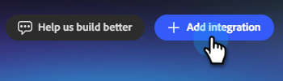

# 连接到HubSpot {#hubspot}

Adobe同事营销活动允许您连接HubSpot帐户以拉入联系人列表。

>[!PREREQUISITES]
>
>要使用此连接器，您必须首先具有：
>
>* 有效的HubSpot帐户
>* 已添加使用以下范围创建的[服务密钥](https://developers.hubspot.com/docs/apps/developer-platform/build-apps/authentication/account-service-keys#create-a-service-key)： `crm.objects.contacts.read`、`crm.objects.leads.read`、`crm.schemas.contacts.read`、`crm.lists.read`、`crm.export`

## 如何连接

1. 在[同事营销活动主页](https://coworker-campaigns.experience.adobe.com/)上，单击&#x200B;**自定义**&#x200B;并选择&#x200B;**连接器**。

   

1. 单击&#x200B;**添加集成**。

   在Connectors屏幕上

   >[!NOTE]
   >
   >如果这不是您的首次集成，则该按钮将显示“添加连接器”。

1. 在HubSpot行中，单击&#x200B;**连接**。

   

1. 此时将显示一个模式窗口，其中显示了必要的权限（本文顶部的先决条件中列出了这些权限）。 单击&#x200B;**继续**。

1. 输入HubSpot **服务密钥**&#x200B;并单击&#x200B;**连接**。

   

连接后，HubSpot将出现在Connectors列表中，在链接联系人列表以从HubSpot进行同步时可以选择。

**断开连接：**

1. 在Connectors屏幕中，找到HubSpot拼贴，然后单击&#x200B;**管理**。

   

1. 单击&#x200B;**断开连接**（此时无需重新输入您的服务密钥）。

   

1. 再次单击&#x200B;**断开连接**&#x200B;以确认。

   
