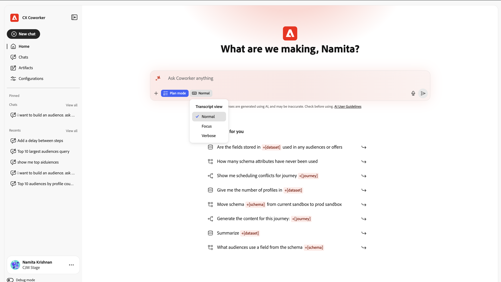
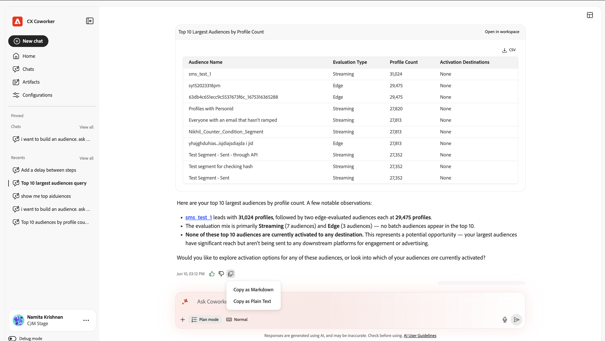
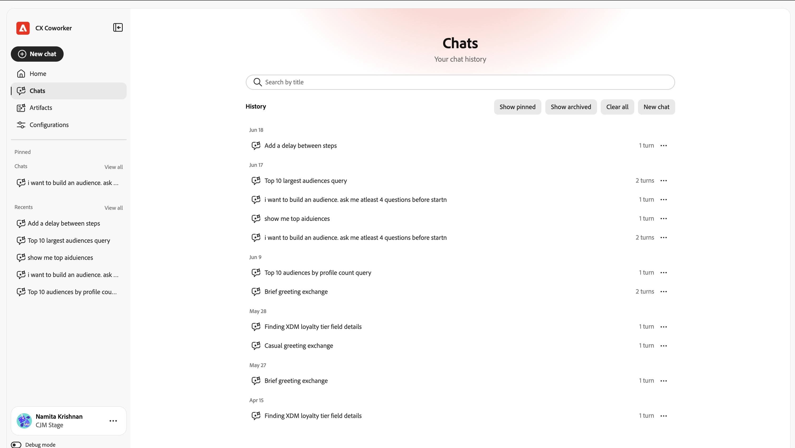

# UI指南 {#ui-guide}

开始使用同事聊天界面。 本指南涵盖方方面面，从访问应用程序、导航工作区到充分利用对话、管理历史记录和定制设置。

>[!VIDEO](https://video.tv.adobe.com/v/3498558?learn=on)

## 访问同事聊天

当您的组织获得对同事的访问权时，您可以通过沉浸式体验或产品内体验来使用其功能。

>[!NOTE]
>
>可通过右上角的同事图标访问产品内体验。 沉浸式体验详细信息概述如下。

下表列出了这些体验在何时可用于每个CX Enterprise应用程序。

| CX企业级应用程序 | 沉浸式体验 | 产品内体验 |
|---|---|---|
| RTCDP | 现在可用 | 即将推出 |
| AJO | 现在可用 | 即将推出 |
| CJA | 现在可用 | 即将推出 |
| AEM | 2026年9月即将推出 | 即将推出 |
| Workfront | 2026年9月即将推出 | 即将推出：  * 2026年9月初在预览模式下，适用于精选Workfront系统管理员  * 2026年9月中旬在生产模式下，适用于符合条件的快速发布Workfront客户  * 2026年10月中旬在生产模式下，适用于符合条件的季度发布Workfront客户 |
| 目标 | 2026年9月即将推出 | 即将推出 |

### 沉浸式体验 {#immersive}

导航到[https://experience.adobe.com/#/coworker](https://experience.adobe.com/#/coworker)并使用您的Adobe凭据登录以访问同事聊天。

您还可以通过从CX Enterprise顶部标题的应用程序选择器中选择&#x200B;**Co-worker**&#x200B;来访问它。

## 选择您的组织和沙盒

当前上下文显示在左侧导航边栏的底部，位于您的姓名和个人资料图片下方。 上下文决定了对话可以访问的数据、技能和连接工具，因此在开始之前先确认上下文。

选择您的名称以打开帐户菜单，您可以在其中切换上下文和更改工作区设置：

| 界面元素 | 描述 |
| --- | --- |
| 主题 | 在浅色和深色之间循环界面主题。 |
| 设置 | 打开工作区设置以查看有关帐户和其他设置的详细信息。 |
| 组织选取器 | 切换IMS组织同事运行时所针对的。 |
| 沙盒选取器 | 切换活动的AEP沙盒。 |
| CX 应用程序 | 跳转到与您的帐户连接的另一个CX Enterprise应用程序。 |
| 注销 | 注销您的Adobe帐户。 |

## 探索界面

CX Co-worker界面有两个主要区域：左侧是导航边栏，窗口其余部分为对话画布。

## 导航边栏

利用边栏，可访问产品的每个部分以及最近的工作。

| 界面元素 | 描述 |
| --- | --- |
| 新建聊天 | 开始新的对话。 您当前的聊天将保存到历史记录中。 |
| 主页 | 返回问候语、输入框和建议的提示。 |
| 聊天 | 打开完整的聊天历史记录以搜索、固定、存档或删除对话。 |
| 配置 | 管理技能、 MCP服务器、市场、插件和内存。 |
| 已固定 | 您主演的对话，保留在顶部以便快速访问。 选择全部查看可在聊天页面中查看它们。 |
| 最近项目 | 您最近的对话。 选择查看全部，打开“聊天”页。 |

## 主屏幕

主页屏幕是您开始的地方。 它显示个性化问候语、输入框和一组建议提示，这些提示是根据同事聊天帮助您在沙盒中完成的任务而绘制的。

### 建议的提示

在“为您推荐”下， CX Co-worker列出了示例任务。 选择任何建议以将其加载到输入框中，然后在发送前对其进行编辑或按原样发送。 建议是一种查看Co-worker Chat支持的工作类型的快速方法：在沙盒之间移动架构、在历程中发现异常、验证数据集等。

### 实体提及

建议的提示和您自己的消息可以使用实体提及来引用沙盒中的特定对象，例如+[架构]、+[历程]和+[数据集]。 实体提及告诉同事聊天您确切的意思是哪个对象，因此您可以通过键入&#x200B;**+**&#x200B;来添加您自己的提及。

## 聊天输入框

输入框（标记为“询问同事任何内容”）是您键入的位置。 文本字段下方是附件、响应行为、语音输入和发送的工具栏。

| 界面元素 | 描述 |
| --- | --- |
| +（附加） | 打开附加菜单以将文件或数据对象添加到消息中。 |
| 计划模式 | 让同事聊天提出分步计划，并在它生效之前暂停以供您审批。 将其关闭，以便让同事聊天直接执行操作。 |
| 记录视图 | 控制显示多少同事聊天内部活动：“正常”、“集中”或“详细”。 |
| 麦克风 | 用语音输入听写您的留言。 再次选择可停止录制。 |
| 发送 | 发送消息。 当同事聊天正在响应时，这将变为可用于中断的停止控制。 |

### 附加文件和数据

选择+将上下文附加到消息：

- 附加文件：上载文件。同事聊天可在响应中读取和引用该文件。
- 添加数据或对象：引用沙盒中的对象，如数据集或架构，因此Co-worker Chat对您的实时数据有效。

### 计划模式

当任务复杂或更改数据，并且您想首先查看方法时，打开“计划”模式。 Co-worker Chat会提供一项计划并等待您的批准，然后再执行计划。 当“计划”模式关闭时，“同事聊天”将直接进入工作。

### 记录视图

成绩单视图设置了Co-worker Chat的推理和工具活动在对话中的内联显示量：

| 界面元素 | 描述 |
| --- | --- |
| 正常 | 总结了一个平衡的观点：关键思考步骤和工具活动。 |
| Focus | 一种简化的视图，可隐藏大多数中间步骤，以便您主要看到答案。 |
| 详细 | 完整的详细信息：每个思考步骤、技能载入、文件读取和查询。 |

## 处理响应

当您发送消息时，“同事聊天”会在打开的状态下完成任务，然后返回其答案。 响应可以包括推理、所使用工具的记录以及一个或多个工件。

### 思考和活动

Co-worker Chat会在运行时显示其功能，以便您可以遵循（和验证）其流程：

- Thinking块：标有“Thuded for”的可折叠步骤，后面跟秒数（或毫秒数）。 展开一个来阅读Co-worker Chat的推理。
- 技能活动：诸如“已加载”技能之类的条目显示“同事聊天”为任务引入的专业能力。
- 文件和查询活动：诸如“读取文件”和“运行1”查询之类的条目，记录了“同事聊天”读取的文件及其运行的查询，每个条目都记录了所花费的时间。

>[!TIP]
>
>使用详细成绩单视图可查看每个步骤，或使用焦点隐藏每个步骤。

### 工件

Co-worker Chat生成的结果（例如受众表）将作为工件卡显示在响应中。 从工件卡中，可以将表工件下载为CSV文件。 当响应包含多个工件时，使用轮盘控件（上一个/下一个和计数，例如1 / 1）可在它们之间移动。

### 阅读分析

在其工件下，同事聊天总结了结果的含义，突出显示重要调查结果并建议您可以采取的后续操作。

### 提供反馈并复制响应

每个响应都具有评级和重复使用的控件：

- 竖起大拇指/竖下大拇指：评价响应以帮助改进未来的答案。
- 复制：使用复制为Markdown格式复制响应（保留格式）或复制为纯文本。

## 管理您的聊天

选择导航边栏中的聊天以打开您的完整历史记录。 对话按日期分组，每行显示聊天标题及其包含的轮次数。

| 界面元素 | 描述 |
| --- | --- |
| 按标题搜索 | 按名称查找过去的对话。 |
| 显示已固定内容 | 仅显示您主持的对话。 |
| 显示已存档 | 显示您已存档的对话。 |
| 新建聊天 | 开始新对话。 |
| 行菜单(...) | 在任何对话中，星形(pin)、重命名、存档或删除它。 |

## 配置

配置是您量身定制同事聊天功能的位置。 它包含五个选项卡：技能、MCP服务器、市场、插件和内存。

### 技能

技能是同事聊天在相关时自动调用的专业功能，或者可以通过在聊天中键入/来触发自己的技能。 “技能”选项卡列出了每项已安装的技能，并允许您添加更多技能。

- 添加Source：从新来源安装技能。
- 搜索：按名称查找技能。
- 更改视图：使用视图切换在网格和列表布局之间切换。

选择某项技能以查看其详细信息：该技能所属插件、同事聊天何时使用该技能的说明以及包含的任何文件。 选择“查看SKILL.md”以阅读技能的完整定义，或选择“删除Source”以卸载技能。

### MCP 服务器

MCP（模型上下文协议）服务器将协同工作聊天连接到外部工具和服务，例如Adobe Journey Optimizer、Real-Time CDP、Target和Workfront。 MCP服务器选项卡列出了当前连接的所有内容以及活动的连接数。

- 添加服务器：连接新的外部工具或服务。

每个信息卡都会显示服务器名称、其端点，以及描述其提供的内容的任何标记。

### 市场

Marketplaces是您可以从中浏览和安装的插件的注册表。 通过“市场”选项卡，可添加注册并按组筛选注册表。

- 添加Marketplace：注册新的插件市场。
- 搜索/按组筛选：缩小列表以查找市场。

每个市场在可以从安装时显示其源和“就绪”状态。

### 插件

插件通过捆绑的技能和MCP服务器（作为一个单元一起安装和管理）扩展了同事聊天。 “插件”选项卡显示已安装的组件，并允许您从市场中添加更多组件。

- 浏览市场：查找要安装的新插件。
- 卸载：删除已安装的插件及其捆绑的所有内容。
- 按市场筛选：查看来自哪个注册表的插件。

### 记忆

记忆功能使“同事聊天”可以记住您跨对话的偏好设置，因此随着时间的推移，其响应将保持相关性和个人性。

- 启用内存：打开或关闭跨会话内存。
- 存储的首选项：已学习并保存“同事聊天”的首选项。 可以编辑、删除或检查每个条目，并且可以按类别筛选条目。
- 保存的记忆历史记录：对存储记忆进行更改的时间表。

