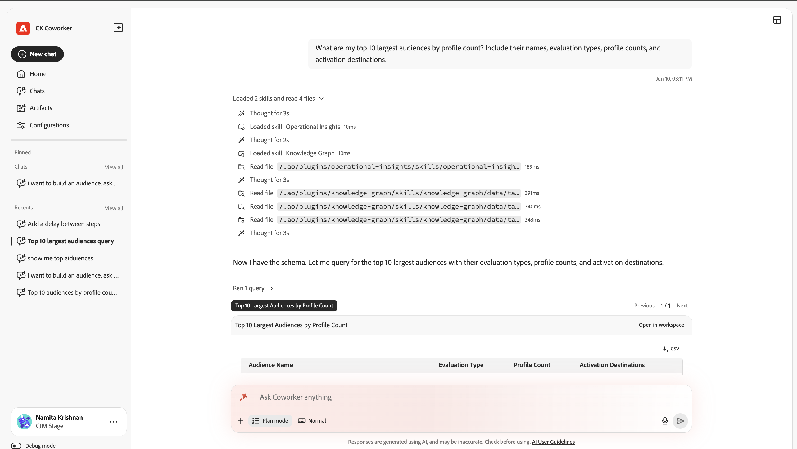

Adobe CX Enterprise Coworker Chat使团队能够使用自然语言自动执行Adobe产品任务，通过灵活的规划、可自定义的技能和智能执行快速将想法转化为操作。 有关同事的更多常规信息，请参阅[CX Enterprise Coworker概述](/help/coworker/overview.md)。

## 通过同事聊天进行数据分析

Co-worker Chat可以执行以前仅在Analysis Workspace中才有的高级数据分析。 Co-worker Chat可访问来自Customer Journey Analytics数据视图或Adobe Analytics报表包的数据，从而允许您浏览这些数据并获得自然语言提示的答案。

在同事聊天中创建可视化图表时，您可以随时在Analysis Workspace中打开该可视化图表，以便进行更多手动控制。

以下信息概述了如何在“同事聊天”中分析数据。

## 在同事聊天中开始分析

首先以简单的语言描述您想要了解的信息。 Co-worker Chat规划分析，查询您的数据视图或报告包，并创建可视化和摘要。

以下用例是示例。 您可以询问有关您有权访问的任何数据

### 主要用例

<!-- The following cards link to each of the stand-alone articles in this folder -->

<!--
CARDS

* https://experienceleague.adobe.com/zh-hans/docs/cx-enterprise-ai/experience-cloud-ai/coworker/chat/use-cases/data-insights/analytics-chat
  {title = Analyze Customer Journey Analytics and Adobe Analytics data}
  {description = Answers natural-language questions about your data views or report suites, builds funnels and other visualizations, and finds where customers drop off. You can open any visualization in Analysis Workspace for further analysis.}
  {cta = Read}
  {image = ../../assets/coworker-funnel-response-card.png}

* https://experienceleague.adobe.com/zh-hans/docs/cx-enterprise-ai/experience-cloud-ai/coworker/chat/use-cases/data-insights/root-cause-analysis
  {title = Explore trends and root causes}
  {description = Identifies trends in your Customer Journey Analytics and Adobe Analytics data and the factors that drive changes in performance, without manual queries.}
  {cta = Read}
  {image = ../../assets/data-validation-aa-cja/trend-line-card.png}
-->
<!-- START CARDS HTML - DO NOT MODIFY BY HAND -->

    

        

            

                <figure class="image x-is-16by9">
                    
                </figure>
            

            

                

                    

                        <a href="https://experienceleague.adobe.com/zh-hans/docs/cx-enterprise-ai/experience-cloud-ai/coworker/chat/use-cases/data-insights/analytics-chat" title="分析Customer Journey Analytics和Adobe Analytics数据">分析Customer Journey Analytics和Adobe Analytics数据</a>
                    

                    
回答有关数据视图或报表包的自然语言问题，构建漏斗和其他可视化图表，并找出客户流失的位置。 您可以在Analysis Workspace中打开任何可视化图表以供进一步分析。

                

                <a href="https://experienceleague.adobe.com/zh-hans/docs/cx-enterprise-ai/experience-cloud-ai/coworker/chat/use-cases/data-insights/analytics-chat" class="spectrum-Button spectrum-Button--outline spectrum-Button--primary spectrum-Button--sizeM" style="align-self: flex-start; margin-top: 1rem;">
                    读取
                </a>
            

        

    

    

        

            

                <figure class="image x-is-16by9">
                    
                </figure>
            

            

                

                    

                        <a href="https://experienceleague.adobe.com/zh-hans/docs/cx-enterprise-ai/experience-cloud-ai/coworker/chat/use-cases/data-insights/root-cause-analysis" title="探索趋势和根本原因">探索趋势和根本原因</a>
                    

                    
无需手动查询，即可识别Customer Journey Analytics和Adobe Analytics数据的趋势以及导致性能发生变化的因素。

                

                <a href="https://experienceleague.adobe.com/zh-hans/docs/cx-enterprise-ai/experience-cloud-ai/coworker/chat/use-cases/data-insights/root-cause-analysis" class="spectrum-Button spectrum-Button--outline spectrum-Button--primary spectrum-Button--sizeM" style="align-self: flex-start; margin-top: 1rem;">
                    读取
                </a>
            

        

    

<!-- END CARDS HTML - DO NOT MODIFY BY HAND -->

<!--
CARDS

* https://experienceleague.adobe.com/en/docs/cx-enterprise-ai/experience-cloud-ai/coworker/chat/use-cases/data-insights/implementation-guide
  {title = Plan your implementation}
  {description = Creates a personalized, step-by-step plan for implementing Customer Journey Analytics, upgrading from Adobe Analytics, or setting up Content Analytics, Marketing Campaign Analytics, or Streaming Media collection on the Edge. Plans include details such as owners, effort estimates, dependencies, and validation steps.}
  {cta = Read}
  {image = ../../assets/ui-guide-6.png}

* https://experienceleague.adobe.com/en/docs/cx-enterprise-ai/experience-cloud-ai/coworker/chat/use-cases/data-insights/intelligent-checklist
  {title = Generate an implementation checklist}
  {description = Turns your Customer Journey Analytics implementation plan into a checklist in Coworker Projects, where your team can assign steps, track status, and add approval gates.}
  {cta = Read}
  {image = ../../assets/data-validation-aa-cja/date-detail.png}
-->
<!-- START CARDS HTML - DO NOT MODIFY BY HAND -->

    

        

            

                <figure class="image x-is-16by9">
                    
                </figure>
            

            

                

                    

                        <a href="https://experienceleague.adobe.com/en/docs/cx-enterprise-ai/experience-cloud-ai/coworker/chat/use-cases/data-insights/implementation-guide" title="规划实施">计划您的实施</a>
                    

                    
创建个性化的分步计划，以在Edge上实施Customer Journey Analytics、从Adobe Analytics升级或设置Content Analytics、Marketing Campaign Analytics或流媒体收集。 计划包括所有者、工作量估计、依赖项和验证步骤等详细信息。

                

                <a href="https://experienceleague.adobe.com/en/docs/cx-enterprise-ai/experience-cloud-ai/coworker/chat/use-cases/data-insights/implementation-guide" class="spectrum-Button spectrum-Button--outline spectrum-Button--primary spectrum-Button--sizeM" style="align-self: flex-start; margin-top: 1rem;">
                    读取
                </a>
            

        

    

    

        

            

                <figure class="image x-is-16by9">
                    
                </figure>
            

            

                

                    

                        <a href="https://experienceleague.adobe.com/en/docs/cx-enterprise-ai/experience-cloud-ai/coworker/chat/use-cases/data-insights/intelligent-checklist" title="生成实施核对清单">生成实施核对清单</a>
                    

                    
将您的Customer Journey Analytics实施计划转换为同事项目中的核对清单，团队可以在其中分配步骤、跟踪状态和添加批准审核。

                

                <a href="https://experienceleague.adobe.com/en/docs/cx-enterprise-ai/experience-cloud-ai/coworker/chat/use-cases/data-insights/intelligent-checklist" class="spectrum-Button spectrum-Button--outline spectrum-Button--primary spectrum-Button--sizeM" style="align-self: flex-start; margin-top: 1rem;">
                    读取
                </a>
            

        

    

<!-- END CARDS HTML - DO NOT MODIFY BY HAND -->

<!--
CARDS

* https://experienceleague.adobe.com/zh-hans/docs/cx-enterprise-ai/experience-cloud-ai/coworker/chat/use-cases/data-insights/data-validation-aa-cja
  {title = Validate data when upgrading from Adobe Analytics to Customer Journey Analytics}
  {description = Compares dimensions, metrics, and trends between your Adobe Analytics report suites and Customer Journey Analytics data views, then recommends fixes to support your upgrade.}
  {cta = Read}
  {image = ../../assets/data-validation-aa-cja/trend-bar-card.png}

* https://experienceleague.adobe.com/en/docs/cx-enterprise-ai/experience-cloud-ai/coworker/chat/use-cases/data-insights/streaming-media-validation
  {title = Validate your Streaming Media implementation}
  {description = Checks your datastream, schema, dataset, data view, and session data to confirm that streaming media tracking is configured and collecting data correctly.}
  {cta = Read}
  {image = ../../assets/ui-guide-8.png}
-->
<!-- START CARDS HTML - DO NOT MODIFY BY HAND -->

    

        

            

                <figure class="image x-is-16by9">
                    
                </figure>
            

            

                

                    

                        <a href="https://experienceleague.adobe.com/zh-hans/docs/cx-enterprise-ai/experience-cloud-ai/coworker/chat/use-cases/data-insights/data-validation-aa-cja" title="从Adobe Analytics升级到Customer Journey Analytics时验证数据">从Adobe Analytics升级到Customer Journey Analytics时验证数据</a>
                    

                    
比较Adobe Analytics报表包和Customer Journey Analytics数据视图之间的维度、量度和趋势，然后建议进行修复以支持您的升级。

                

                <a href="https://experienceleague.adobe.com/zh-hans/docs/cx-enterprise-ai/experience-cloud-ai/coworker/chat/use-cases/data-insights/data-validation-aa-cja" class="spectrum-Button spectrum-Button--outline spectrum-Button--primary spectrum-Button--sizeM" style="align-self: flex-start; margin-top: 1rem;">
                    读取
                </a>
            

        

    

    

        

            

                <figure class="image x-is-16by9">
                    
                </figure>
            

            

                

                    

                        <a href="https://experienceleague.adobe.com/en/docs/cx-enterprise-ai/experience-cloud-ai/coworker/chat/use-cases/data-insights/streaming-media-validation" title="验证您的流媒体实施">验证您的流媒体实施</a>
                    

                    
检查您的数据流、架构、数据集、数据视图和会话数据，以确认流媒体跟踪已配置并正确收集数据。

                

                <a href="https://experienceleague.adobe.com/en/docs/cx-enterprise-ai/experience-cloud-ai/coworker/chat/use-cases/data-insights/streaming-media-validation" class="spectrum-Button spectrum-Button--outline spectrum-Button--primary spectrum-Button--sizeM" style="align-self: flex-start; margin-top: 1rem;">
                    读取
                </a>
            

        

    

<!-- END CARDS HTML - DO NOT MODIFY BY HAND -->

<!--
CARDS

* https://experienceleague.adobe.com/zh-hans/docs/cx-enterprise-ai/experience-cloud-ai/coworker/chat/use-cases/data-insights/validate-dataset-quality-for-cja
  {title = Validate dataset quality for Customer Journey Analytics}
  {description = Identifies the datasets that feed your Customer Journey Analytics reporting, then checks schemas, identity quality, and field quality so you can resolve issues before you build dashboards.}
  {cta = Read}
  {image = ../../assets/data-validation-aep/dataset-validation.png}

* https://experienceleague.adobe.com/zh-hans/docs/cx-enterprise-ai/experience-cloud-ai/coworker/chat/use-cases/data-insights/data-validation-aep
  {title = Validate data after ingestion into Experience Platform}
  {description = Runs statistical and semantic checks on Experience Platform datasets and fields to find data quality issues, such as invalid values or mapping problems.}
  {cta = Read}
  {image = ../../assets/data-validation-aep/null-values.png}
-->
<!-- START CARDS HTML - DO NOT MODIFY BY HAND -->

    

        

            

                <figure class="image x-is-16by9">
                    
                </figure>
            

            

                

                    

                        <a href="https://experienceleague.adobe.com/zh-hans/docs/cx-enterprise-ai/experience-cloud-ai/coworker/chat/use-cases/data-insights/validate-dataset-quality-for-cja" title="验证Customer Journey Analytics的数据集质量">验证Customer Journey Analytics的数据集质量</a>
                    

                    
识别用于提供Customer Journey Analytics报表的数据集，然后检查架构、身份质量和字段质量，以便在构建功能板之前解决问题。

                

                <a href="https://experienceleague.adobe.com/zh-hans/docs/cx-enterprise-ai/experience-cloud-ai/coworker/chat/use-cases/data-insights/validate-dataset-quality-for-cja" class="spectrum-Button spectrum-Button--outline spectrum-Button--primary spectrum-Button--sizeM" style="align-self: flex-start; margin-top: 1rem;">
                    读取
                </a>
            

        

    

    

        

            

                <figure class="image x-is-16by9">
                    
                </figure>
            

            

                

                    

                        <a href="https://experienceleague.adobe.com/zh-hans/docs/cx-enterprise-ai/experience-cloud-ai/coworker/chat/use-cases/data-insights/data-validation-aep" title="将数据摄取到Experience Platform后验证数据">将数据摄取到Experience Platform后验证数据</a>
                    

                    
对Experience Platform数据集和字段运行统计和语义检查以查找数据质量问题，例如无效值或映射问题。

                

                <a href="https://experienceleague.adobe.com/zh-hans/docs/cx-enterprise-ai/experience-cloud-ai/coworker/chat/use-cases/data-insights/data-validation-aep" class="spectrum-Button spectrum-Button--outline spectrum-Button--primary spectrum-Button--sizeM" style="align-self: flex-start; margin-top: 1rem;">
                    读取
                </a>
            

        

    

<!-- END CARDS HTML - DO NOT MODIFY BY HAND -->

有关这些用例的更多信息，包括它们使用的技能和示例提示，请参阅[数据分析用例](/help/coworker/chat/use-cases/overview.md#data-insights)。

### 快速入门

同事聊天还可以帮助您：

* **比较性能**：并排比较跨渠道、时间段或区段的量度。
* **衡量促销活动效果**：了解在给定时间段内促销活动、渠道和Web属性的执行情况。
* **分析漏斗**：浏览多步转化漏斗并查看每个阶段的流失情况。
* **预测量度**：预测来自历史Customer Journey Analytics或Adobe Analytics数据的未来量度值，例如您是否走上了实现收入目标的道路。
* **创建执行摘要和KPI摘要**：制作适用于利益相关者的绩效摘要、建议和幻灯片组概述。
* **分析运行趋势和原因**：查询受众、数据集和历程的历史时间序列数据，并确定导致更改的原因。
* **创建自定义Customer Journey Analytics技能**：将您重复的分析转换为可重复使用的技能，该技能会跨会话持续存在。

<!--
CARDS

* https://experienceleague.adobe.com/zh-hans/docs/cx-enterprise-ai/experience-cloud-ai/coworker/chat/use-cases/data-insights/analytics-chat
  {title = Analyze data with Coworker Chat}
  {description = Ask questions in natural language to build funnels, create visualizations, and find where customers drop off in the journey.}
  {cta = Read}
  {image = ../../assets/coworker-funnel-response-card.png}

* https://experienceleague.adobe.com/zh-hans/docs/cx-enterprise-ai/experience-cloud-ai/coworker/chat/use-cases/data-insights/root-cause-analysis
  {title = Explore trends and root causes}
  {description = Investigate changes in your Customer Journey Analytics data and uncover what drives them, without writing manual queries.}
  {cta = Read}
  {image = ../../assets/data-validation-aa-cja/trend-line-card.png}
-->
<!-- START CARDS HTML - DO NOT MODIFY BY HAND -->

    

        

            

                <figure class="image x-is-16by9">
                    
                </figure>
            

            

                

                    

                        <a href="https://experienceleague.adobe.com/zh-hans/docs/cx-enterprise-ai/experience-cloud-ai/coworker/chat/use-cases/data-insights/analytics-chat" title="通过同事聊天分析数据">使用同事聊天分析数据</a>
                    

                    
用自然语言提出问题以构建漏斗、创建可视化图表并查找客户在历程中的流失位置。

                

                <a href="https://experienceleague.adobe.com/zh-hans/docs/cx-enterprise-ai/experience-cloud-ai/coworker/chat/use-cases/data-insights/analytics-chat" class="spectrum-Button spectrum-Button--outline spectrum-Button--primary spectrum-Button--sizeM" style="align-self: flex-start; margin-top: 1rem;">
                    读取
                </a>
            

        

    

    

        

            

                <figure class="image x-is-16by9">
                    
                </figure>
            

            

                

                    

                        <a href="https://experienceleague.adobe.com/zh-hans/docs/cx-enterprise-ai/experience-cloud-ai/coworker/chat/use-cases/data-insights/root-cause-analysis" title="探索趋势和根本原因">探索趋势和根本原因</a>
                    

                    
调查Customer Journey Analytics数据中的更改，找出驱动这些更改的因素，而无需编写手动查询。

                

                <a href="https://experienceleague.adobe.com/zh-hans/docs/cx-enterprise-ai/experience-cloud-ai/coworker/chat/use-cases/data-insights/root-cause-analysis" class="spectrum-Button spectrum-Button--outline spectrum-Button--primary spectrum-Button--sizeM" style="align-self: flex-start; margin-top: 1rem;">
                    读取
                </a>
            

        

    

<!-- END CARDS HTML - DO NOT MODIFY BY HAND -->

<!--
CARDS

* https://experienceleague.adobe.com/zh-hans/docs/cx-enterprise-ai/experience-cloud-ai/coworker/chat/use-cases/data-insights/validate-dataset-quality-for-cja
  {title = Validate Customer Journey Analytics data}
  {description = Check dataset quality with the data validation skill and resolve issues before you build dashboards.}
  {cta = Read}
  {image = ../../assets/data-validation-aep/dataset-validation.png}

* https://experienceleague.adobe.com/zh-hans/docs/cx-enterprise-ai/experience-cloud-ai/coworker/chat/use-cases/data-insights/data-validation-aa-cja
  {title = Validate data during your upgrade}
  {description = Compare Adobe Analytics and Customer Journey Analytics data to confirm that your upgrade is on track.}
  {cta = Read}
  {image = ../../assets/data-validation-aa-cja/trend-bar-card.png}
-->
<!-- START CARDS HTML - DO NOT MODIFY BY HAND -->

    

        

            

                <figure class="image x-is-16by9">
                    
                </figure>
            

            

                

                    

                        <a href="https://experienceleague.adobe.com/zh-hans/docs/cx-enterprise-ai/experience-cloud-ai/coworker/chat/use-cases/data-insights/validate-dataset-quality-for-cja" title="验证Customer Journey Analytics数据">验证Customer Journey Analytics数据</a>
                    

                    
使用数据验证技能检查数据集质量，并在构建功能板之前解决问题。

                

                <a href="https://experienceleague.adobe.com/zh-hans/docs/cx-enterprise-ai/experience-cloud-ai/coworker/chat/use-cases/data-insights/validate-dataset-quality-for-cja" class="spectrum-Button spectrum-Button--outline spectrum-Button--primary spectrum-Button--sizeM" style="align-self: flex-start; margin-top: 1rem;">
                    读取
                </a>
            

        

    

    

        

            

                <figure class="image x-is-16by9">
                    
                </figure>
            

            

                

                    

                        <a href="https://experienceleague.adobe.com/zh-hans/docs/cx-enterprise-ai/experience-cloud-ai/coworker/chat/use-cases/data-insights/data-validation-aa-cja" title="在升级期间验证数据">在升级期间验证数据</a>
                    

                    
比较Adobe Analytics和Customer Journey Analytics数据，确认升级按计划进行。

                

                <a href="https://experienceleague.adobe.com/zh-hans/docs/cx-enterprise-ai/experience-cloud-ai/coworker/chat/use-cases/data-insights/data-validation-aa-cja" class="spectrum-Button spectrum-Button--outline spectrum-Button--primary spectrum-Button--sizeM" style="align-self: flex-start; margin-top: 1rem;">
                    读取
                </a>
            

        

    

<!-- END CARDS HTML - DO NOT MODIFY BY HAND -->

## 主要用例的表布局

<!-- The following table are links to each of the stand-alone articles in this folder -->

| 用例 | 说明 |
| --- | --- |
| [分析Customer Journey Analytics和Adobe Analytics数据](/help/coworker/chat/use-cases/data-insights/analytics-chat.md) | 回答有关数据视图或报表包的自然语言问题，构建漏斗和其他可视化图表，并找出客户流失的位置。 您可以在Analysis Workspace中打开任何可视化图表以供进一步分析。 |
| [探索趋势和根本原因](/help/coworker/chat/use-cases/data-insights/root-cause-analysis.md) | 无需手动查询，即可识别Customer Journey Analytics和Adobe Analytics数据的趋势以及导致性能发生变化的因素。 |
| [计划您的实施](/help/coworker/chat/use-cases/data-insights/implementation-guide.md) | 创建个性化的分步计划，以在Edge上实施Customer Journey Analytics、从Adobe Analytics升级或设置Content Analytics、Marketing Campaign Analytics或流媒体收集。 计划包括所有者、工作量估计、依赖项和验证步骤等详细信息。 |
| [生成实施核对清单](/help/coworker/chat/use-cases/data-insights/intelligent-checklist.md) | 将您的Customer Journey Analytics实施计划转换为同事项目中的核对清单，团队可以在其中分配步骤、跟踪状态和添加批准审核。 |
| [从Adobe Analytics升级到Customer Journey Analytics时验证数据](/help/coworker/chat/use-cases/data-insights/data-validation-aa-cja.md) | 比较Adobe Analytics报表包和Customer Journey Analytics数据视图之间的维度、量度和趋势，然后建议进行修复以支持您的升级。 |
| [验证您的流媒体实施](/help/coworker/chat/use-cases/data-insights/streaming-media-validation.md) | 检查您的数据流、架构、数据集、数据视图和会话数据，以确认流媒体跟踪已配置并正确收集数据。 |
| [验证Customer Journey Analytics的数据集质量](/help/coworker/chat/use-cases/data-insights/validate-dataset-quality-for-cja.md) | 识别用于提供Customer Journey Analytics报表的数据集，然后检查架构、身份质量和字段质量，以便在构建功能板之前解决问题。 |
| [将数据摄取到Experience Platform后验证数据](/help/coworker/chat/use-cases/data-insights/data-validation-aep.md) | 对Experience Platform数据集和字段运行统计和语义检查以查找数据质量问题，例如无效值或映射问题。 |

有关这些用例的更多信息，包括它们使用的技能和示例提示，请参阅[数据分析用例](/help/coworker/chat/use-cases/overview.md#data-insights)。

