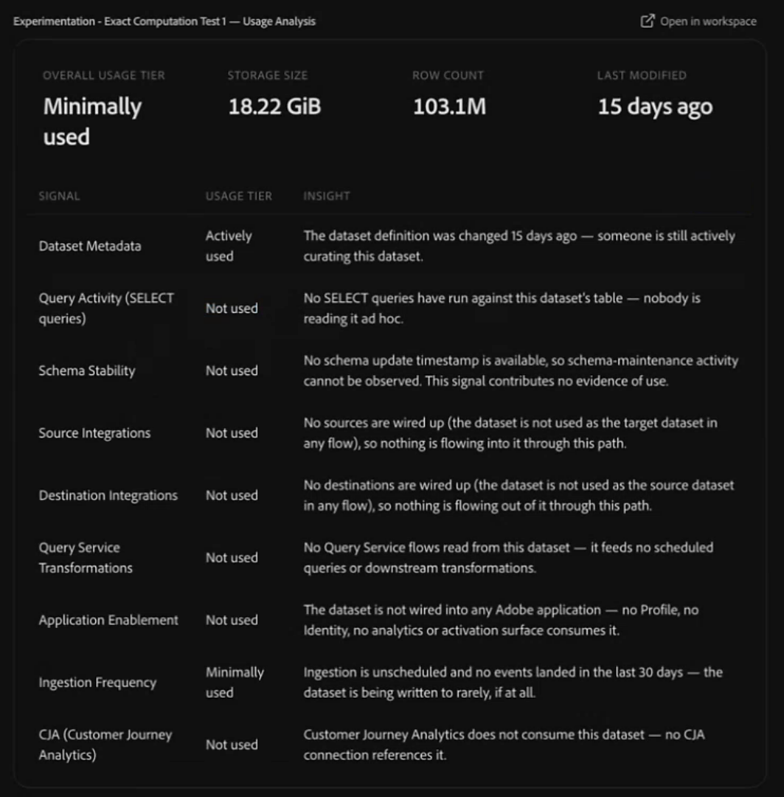

# 管理数据湖保留

使用CX Coworker了解沙盒中Experience Event数据的价值，并确定可能受益于优化的数据。 您可以从广泛的请求开始，例如请求同事优化沙盒数据或清理数据集。 Co-worker使用Data Management Agent公开值得调查的数据集、分析数据集的使用积极性、对保留期的影响进行建模，并在适当时帮助您管理其数据湖保留策略。

## 开始之前 {#before-you-begin}

确保您使用的沙盒包含要审查的数据集。 您还需要访问Data Management Agent和所需的Adobe Experience Platform权限。 请参阅[数据管理代理先决条件](../../../../agents/data-management.md#prerequisites)。

## 优化沙盒中的数据 {#optimize-data-in-your-sandbox}

将这些技能一起用作工作流。 从广泛的数据管理目标开始，例如了解数据的价值或优化沙盒中的数据。 Co-worker可帮助您查找值得调查的数据集，检查数据集的使用积极性，对潜在保留期的影响进行建模，然后在您准备好采取行动时设置、更改或删除保留策略。

### 查找值得优化的数据 {#find-data-worth-optimizing}

要确定从何处开始，请让同事确定值得调查的体验事件数据集。 您可以从询问数据、数据优化或数据集清理的价值开始。 使用“列出数据集”技能查看存储大小、行数、现有保留状态和配置文件启用。 您可以按数据集大小、行数或最近访问等条件筛选结果以缩小列表范围。 该技能为只读。 Co-worker会返回一个您可以扫描和比较的表，以及按大小、行数和数据保留时间突出显示数据集的可视化图表。

在缩小列表范围后，使用分析数据集使用技能来了解特定数据集的使用活动。

并非所有通过这项技能发现的未使用或放弃的数据集都是数据湖保留策略的理想候选对象。 如果您需要删除整个数据集或管理其他Experience Platform存储中的数据，请参阅[选择正确的数据生命周期管理功能](https://experienceleague.adobe.com/en/docs/experience-platform/data-lifecycle/choose-a-capability)。 在设置数据湖保留策略之前，请确认该数据集是体验事件数据集。

示例提示：

- “我感觉我的数据可以优化。”
- “帮助我理解我的数据的价值。”
- “优化我的沙盒数据。”
- “清理我的沙盒数据集。”
- “给我看看我最大的事件数据集。”
- “向我显示大于100 GB且没有数据湖保留设置的数据集。”
- “我需要删除大约2 TB的数据。 我应该从哪里开始？”
- “你能帮我查找孤立、废弃或未使用的数据吗？”
- “优先处理过去90天内未访问过的数据集。”

### 检查数据集的使用活动 {#check-how-actively-a-dataset-is-used}

在确定某个数据集是否是数据湖保留策略的良好候选数据集之前，请了解该数据集的使用积极性。 使用分析数据集使用技巧评估多个使用信号的特定数据集。 这些信号包括最近的摄取活动、查询活动、架构稳定性，以及数据集是否为其他Adobe Experience Platform应用程序提供了信息源。 该技能为只读。 Co-worker会返回总体使用层、信号划分以及它们所指示的数据集内容的简单语言摘要。

<!-- TODO: Confirm the final usage-tier thresholds with engineering after the planned update from a 7-day to a 30-day analysis window is complete. Update this section with the final definitions before publishing. -->

>[!NOTE]
>
>显示的量度旨在提供有用的信号，并且可能并不表示与您的决策相关的所有因素。 我们建议在采取行动之前，查看可用的详细信息并应用您的业务环境。

示例提示：

- “我的Web事件数据集的使用积极性如何？”

### 模拟保留期的影响 {#model-the-impact-of-a-retention-period}

在提交特定的保留期之前，请了解将保留或删除多少数据。 使用“分析数据集保留”技能可查看数据集的存储量度及其数据的年龄分布。 然后，它使用该分布来建模建议的保留期将保留或移除的数据量。 Co-worker按行数和存储大小显示估计的影响。

该技能为只读。 Co-worker直接在对话中返回数据年龄和影响分析，因此您可以在决定是否更改它们之前，将结果与数据集的当前保留设置进行比较。

示例提示：

- “如果在此数据集中设置60天的保留期，将会产生什么影响？”

### 设置、更改或删除保留策略 {#set-change-or-remove-a-retention-policy}

>[!IMPORTANT]
>
>最小数据湖保留期限为30天。 不支持较短的周期。

确定保留期后，使用管理数据集保留技能在数据集上设置、更改或删除数据湖保留策略。 该技能可让您在应用任何更改之前了解建议的影响。 该策略仅在您明确批准请求后应用。 描述您想要的更改不会应用它。

确认保留策略后，可能需要一段时间才能将更改显示在Adobe Experience Platform UI中。 保留策略不会立即删除过期的数据。 初始保留作业在应用策略后的24小时内开始。 初次运行后，计划作业每30天会评估和删除一次过期的记录。 有关保留和清除的详细信息，请参阅[Experience Event数据集保留(TTL)指南](https://experienceleague.adobe.com/en/docs/experience-platform/catalog/datasets/experience-event-dataset-retention-ttl-guide)。

每次保留策略更改都记录在审核跟踪中，包括策略设置、更改或删除的时间。 审核记录可记录每次更改的人员、更改发生的时间以及更改的内容。 您可以单击同事提供的链接，在Adobe Experience Platform的数据集“审核日志”选项卡中查看这些事件。 有关详细信息，请参阅[审核日志概述](https://experienceleague.adobe.com/zh-hans/docs/experience-platform/landing/governance-privacy-security/audit-logs/overview)。

示例提示：

- “将此数据集上的保留期设置为60天。”
- “删除此数据集上的保留策略。”

## 最佳实践 {#best-practices}

使用数据管理代理时，请牢记以下做法：

- **从大致的目标开始。** 如果您不知道哪个数据集需要引起注意，请让同事帮助您了解数据的价值或优化沙盒中的数据。 在分析单个数据集之前，使用列表数据集技能识别具有建议低使用情况或最近无使用情况的信号的数据集。
- **在确认之前查看影响预览。** 在批准保留更改之前，请查看将保留和删除的内容。
- **允许有时间显示更改。** 在CX Coworker中确认保留更改后，请留出一段时间让Adobe Experience Platform UI反映该更改。

## 后续步骤 {#next-steps}

要了解有关数据管理代理的技能、范围、行为和限制的更多信息，请参阅[数据管理代理概述](../../../../agents/data-management.md)。 有关Adobe Experience Platform中数据湖保留策略如何工作的更多信息，请参阅[Experience Event数据集保留(TTL)指南](https://experienceleague.adobe.com/en/docs/experience-platform/catalog/datasets/experience-event-dataset-retention-ttl-guide)。
