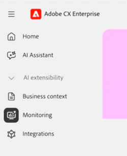

# Agentic AI监控仪表板

Agentic AI [!UICONTROL 监控]仪表板使Center of Excellence (COE)成员和其他治理利益相关者能够了解代理AI的使用和采用。 查看7天或30天趋势以了解谁使用[!DNL AI Assistant]或其他表面（如[Adobe Marketing Agent for Microsoft 365 Copilot](https://experienceleague.adobe.com/zh-hans/docs/cx-enterprise-ai/experience-cloud-ai/agents/ama-ms)）与[!DNL Experience Platform Agents]交互以及他们收到的值。 这些视图共同帮助您使用数据而不是假设来指导代理采用。

**可用性**

* 目前，任何拥有至少一个Experience Platform本机应用程序（Customer Journey Analytics、Journey Optimizer或Real-Time CDP）许可证的帐户都可以访问此仪表板
* 此仪表板不涉及[AI优先应用程序](agentic-ai.md#ai-first-cx-enterprise-applications)（如Experimentation Accelerator、LLM Optimizer和Sites Optimizer）的使用和采用量度。

[!UICONTROL 监控]仪表板包含以下视图：

| 功能板 | 用途 |
| --- | --- |
| **概述** | 跨用户、对话、反馈和信用消耗的汇总量度 |
| **用户** | 按用户的使用频率、分布和参与 |
| **反馈** | 响应质量和用户满意度的信号 |
| **AI积分** | 信用消耗趋势和余额 |

Adobe CX Enterprise中的[代理AI](agentic-ai.md)文档在现有CX Enterprise应用程序[&#128279;](agentic-ai.md#existing-apps-table)表的AI代理中列出了用于监视使用情况的作用域中的代理。

>[!VIDEO](https://video.tv.adobe.com/v/3491864?learn=on)

## 启用功能板权限 {#permissions}

通过更新每个授权用户的产品配置文件或角色，在[!DNL Adobe Experience Platform]中授予仪表板访问权限。 启用权限后，[!UICONTROL 监视]功能将在CX Enterprise主页上向用户显示。

>[!IMPORTANT]
>
>监控数据仅在默认的生产沙盒中可用。 不支持使用开发沙盒查看监控数据。 用户必须具有默认生产沙盒所需的监控权限，并切换到沙盒以查看监控数据。
>
>为防止混淆，Adobe建议跨所有沙盒（包括默认的生产沙盒）授予监视权限。 这有助于确保用户可以访问监控仪表板，而不管当前选择了什么沙盒，并减少将不支持的沙盒误认为空仪表板或无法正常工作的仪表板的可能性。

**启用仪表板权限**

1. 转到[!DNL Experience Platform] **管理** > **权限**。

1. 打开要更新的产品配置文件或角色。

   

1. 在&#x200B;**[!UICONTROL AI助手]**&#x200B;权限下，单击&#x200B;**[!UICONTROL 添加资源]**，然后启用&#x200B;**[!UICONTROL 查看AI助手使用情况仪表板]**。

   此权限授予对Agentic AI使用监控仪表板的访问权限。

1. 在&#x200B;**[!UICONTROL 功能板]**&#x200B;权限下，根据每个用户的责任配置功能板访问权限。

   

   授权治理用户的建议权限：

   * **[!UICONTROL 查看许可证使用情况仪表板]**
   * **[!UICONTROL 查看标准仪表板]**
   * **[!UICONTROL 导出仪表板数据]**（可选，仅适用于已批准的治理用户）

   您可以根据需要授予的其他权限：

   * **[!UICONTROL 管理自定义仪表板]**
   * **[!UICONTROL 查看自定义仪表板]**
   * **[!UICONTROL 管理标准仪表板]**

1. 要查看仪表板，请返回CX Enterprise主页，然后单击&#x200B;**[!UICONTROL 监视]**。

   

## 概述仪表板

概述仪表板是整个组织中采用和参与量度的中心位置。 它将高级趋势与更深入的分析联系起来。 要查看影响量度的因素，请查看来自任何量度的个人对话。

### “概述”功能板上的量度

* **随时间推移提示：**&#x200B;总体使用增长和采用趋势。
* **活动用户和对话：**&#x200B;与[!DNL Experience Platform Agents]交互的用户数。
* **每个对话的平均提示数：**&#x200B;每个对话的参与深度。
* **反馈：**&#x200B;来自用户的向上和向下拇指分布反馈（仅适用于[!DNL AI Assistant]交互）。

>[!VIDEO](https://video.tv.adobe.com/v/3491865?learn=on)

### 对话重播

对话重放显示单个交互，而不仅仅是聚合。 您可以分析多个对话的模式，并从高级趋势转移到特定对话。

* **提示和响应历史记录：**&#x200B;用户的提示和响应已传递。
* **反馈信号：**&#x200B;用户通过竖起或竖下大拇指进行交互，以识别摩擦、阻止或支持需求。 此信息可帮助您的组织改善提示相关性，并帮助Adobe在一段时间内提高响应质量。

>[!VIDEO](https://video.tv.adobe.com/v/3491866?learn=on)

## 用户仪表板

“用户”仪表板显示随着时间的推移，不同用户的代理采用和参与度的变化。 您可以查看哪些人主动使用[!DNL Experience Platform Agents]，他们使用哪个表面以及他们参与的频率。 管理员和COE成员可以深入了解各个用户活动和对话，以了解参与模式和使用行为。

### 用户仪表板上的量度

* **一段时间内的采用和参与趋势：**&#x200B;跟踪选定时间段内用户区段的变化情况。 用户被分类为：
  * **新：**&#x200B;选定时段内的第一个活动，在前12个月内无活动。
  * **重复：**&#x200B;选定时段和上一个时段中的活动。
  * **返回：**&#x200B;选定时段内的活动，但不是前一时段内的活动。
  * **不活动：**&#x200B;选定时段中没有活动，但前一时段有活动。
* **用户参与模式：**&#x200B;用户与代理进行交互的频率以及参与随时间变化的频率。
* **对话活动：**&#x200B;每个用户的对话数和提示数。
* **最活跃用户：**&#x200B;高度参与的用户和团队推动采用代理。

>[!VIDEO](https://video.tv.adobe.com/v/3491868?learn=on)

## 反馈仪表板

“反馈”仪表板显示针对代理交互提交的用户反馈。 您可以查看哪些对话用户以正面或负面方式标记，并调查反馈背后的交互。 要查看提示、响应、推理详细信息和反馈注释，请从反馈摘要中深入了解各个对话。

### 反馈仪表板上的量度

* **反馈随时间变化的趋势：**&#x200B;用户反馈随时间变化的方式。
* **向上和向下拇指反馈：**&#x200B;正面和负面交互信号。
* **反馈类别：**&#x200B;每条竖起大拇指和竖起大拇指背后的理由。
* **提示和响应历史记录：**&#x200B;用户提示和与提交的反馈关联的响应。
* **反馈详细信息和注释：**&#x200B;反馈提交期间用户的其他上下文和注释。

>[!VIDEO](https://video.tv.adobe.com/v/3491878?learn=on)

## AI信用仪表板

AI信用仪表板显示贵组织对[!DNL Experience Platform Agents]的使用如何转化为AI信用消费。

### AI信用仪表板上的量度

* **已使用的AI积分总数：** AI积分中的代理总使用量。
* **每日和每月趋势：**&#x200B;消费模式的尖峰、下降和变化。
* **AI剩余信用额度：**&#x200B;剩余信用额度，以便您能够主动计划并避免超额。

>[!VIDEO](https://video.tv.adobe.com/v/3491867?learn=on)

## 有关此主题的更多帮助

* [!DNL Experience Platform]中的[许可证使用情况仪表板](https://experienceleague.adobe.com/zh-hans/docs/experience-platform/dashboards/guides/license-usage)
* [Adobe CX Enterprise中的代理AI](agentic-ai.md)
* [代理作业和AI信用消耗](ai-credit-consumption.md)
* [许可证使用情况仪表板](https://experienceleague.adobe.com/zh-hans/docs/experience-platform/dashboards/guides/license-usage) (Experience Platform)
